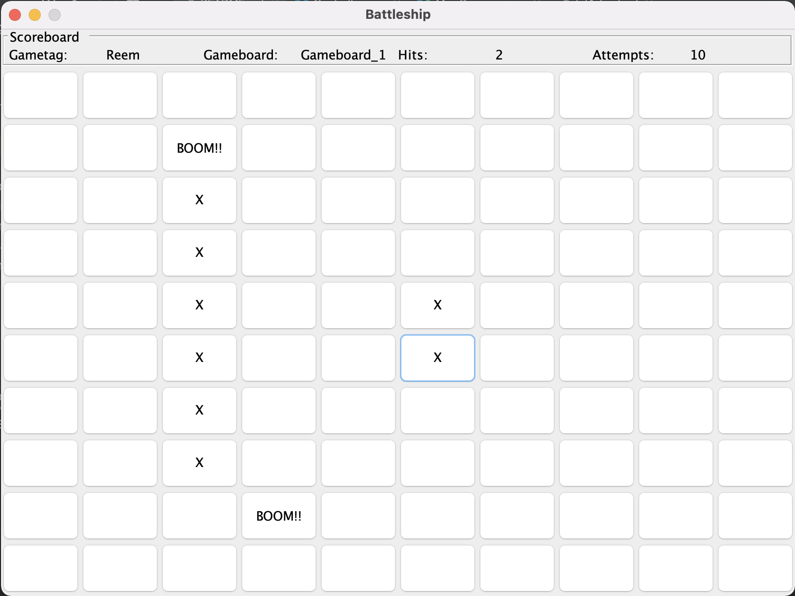

# Battleship game
## This game, was a school assignment of a group of two.  

The UI was built using **Java Swing**.

We implemented two types of game boards, with different ships and places. You start by choosing the gameboard.

Then you get the game screen:



Here is how e.g. gameboard (1) is implemented:
```sh
• u-båt, 1 square = A
• torpedbåt, 2 squares = B
• jagare, 3 squares = C
• kryssare, 4 squares = D
• slagskepp, 5 squares = E
    0 1 2 3 4 5 6 7 8 9 10
0   * * * * * E E E E E *
1   * * C C C * * * * * *
2   * * * * * * * * * * *
3   * * * * * * * * * * *
4   * * * D * * * * * * *
5   * * * D * * * * * * *
6   * * * D * * B * * * *
7   * * * D * * B * * * *
9   A * * * * * * * * * *
    0 1 2 3 4 5 6 7 8 9 10
```

At the end of each game the player sees a highscore list, and may choose to play again!
